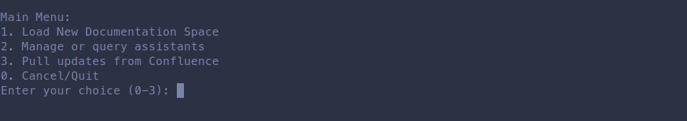
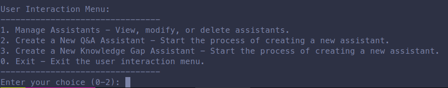

# TopAssist
The documentation Chat Bot.

Technically, it is an app implementing Retrieval Augmented Generation to provide a chat bot as an interface for accessing documentation.

Inspired by https://github.com/MDGrey33/Nur

# Setup
### Prerequisites:
- Python 3.12
- poetry
- docker

### Managing python version with `asdf`

Install `asdf` from https://asdf-vm.com/

```
# install plugin for python version management
asdf plugin add python

# install python version declared in .tool-versions
asdf install python

# test it
python --version
Python 3.12.2
```

The version that `asdf` will use for the current project is declared in `.tool-versions` file.

## Configuration
1. Rename .env.example to .env
2. Edit it to fill missing values

## Quick Setup

```sh
bin/setup # See bin/setup --help to check the options
```

## Install dependencies

`poetry install`


# Running

## Databases

Top Assist uses two databases: `postgresql` and `weaviate`.
Please be sure that you set all the required environment variables in the `.env` file in `# Database` section.
To run the databases, you can use `docker compose`

**Warning**: `docker-compose.yml` comes with a few profiles. Most notable ones are:
* *default* (not declared explicitly) - 3rd party dependencies that should run in all environments.
* `dev` - DEV-specific additional services: `dev_runner` (an instance of `top-assist` for `exec`-uting commands).
* `dev_app` - DEV-specific instances of the app (`bin/web` and `bin/chat_bot`)

Therefore to spin up only the 3rd party dependencies for local development run `docker compose` without `--profile` argument.

```sh
docker compose up
bin/migrate # to setup PostgreSQL database
```

You can also use the `bin/psql` helper to open a db console or run quick queries, e.g.
```sh
# Open psql console
bin/psql

# Run a query
bin/psql -c 'SELECT id,question_text,channel_id FROM qa_interactions ORDER BY id DESC LIMIT 1'
```

### Migrations

1) `bin/generate_migration "Add my new model"`
Alembic will detect the changes in the models/tables and create a new migration file.
!!! That will only **_draft_** the migration. Make sure to review and finalize it !!!
!!! The generated migration is not executed at this point !!!

2) Apply the migration:
`bin/migrate`

3) To rollback last N migrations run:
`poetry run alembic downgrade -N`

4) To reset the database and apply all migrations again:
`poetry run alembic downgrade base && poetry run alembic upgrade head`

## Admin menu

`bin/menu`

## Admin actions (non interactive)

```
# list confluence spaces
bin/cli list_spaces

# import given spaces (by keys)
bin/cli import_spaces --space ~12345678 --space TA
```

## Chat bot (Slack listener)

1. Refer to the ./documentation/slack_app_manifest_installation_guide.md for slack app setup
2. `bin/chat_bot`

## Web

`bin/web` (API / uvicorn web server, currently is not used)

# Testing

## pytest

Unit tests are located inside `tests` directory.

Execution with coverage report:
* fail if coverage is below 0% (`--cov-fail-under`)
* location of code to be included in the coverage report: `--cov=relative_path/`

```sh
poetry run pytest --cov-fail-under=0 --cov=file_system/
```

Alternatively you can use the bin/pytest helper:

```sh
# Run all unit tests by default (tests/unit)
bin/pytest

# Run specific test
bin/pytest tests/unit/logging/test_json_formatter.py
```

## Lint

Use the `bin/lint` helper
```sh
bin/lint
```

## Console

Use the `bin/console` helper

```sh
bin/console
```

## Metrics

Top Assist uses Prometheus and Grafana to keep tracking of business metrics.

You can test Prometheus and Grafana integration by running:

```sh
bin/setup --metrics

# or

docker compose --profile dev_metrics up -d --build
```

Then open Grafana in http://localhost:9000 (user: admin, password: admin), it will automatically load the datasource from `docker/grafana/provisioning/datasources/` and the dashboards from `docker/grafana/import_dashboards/`, if you want to test any change make sure to copy the dashboard json and replace their contents.

If you only want tests the metrics without starting Prometheus/grafana you can also start the process locally and run `curl http://localhost:9090`, note that on the development environment it will autoincrement the port for each process, so if you start 2 processes you can use port 9090 and 9091, e.g.


```s
bin/chat_bot

curl http://localhost:9090 # Prints chat_bot metrics

# In another terminal
bin/web

curl http://localhost:9091 # Prints web metrics
```

## Configuring External Resources

### Open AI Asssistants

1. Setup top-assist locally with your `OPENAI_API_KEY`

2. Run bin/menu

3. Select Option 2. Manage or query assistants



4. Then create the assistants by clicking on Option 2 and Option 3



5. Then update the OPENAI_ASSISTANT_ID_* envs

### Slack

See [Slack Manifest Guide](documentation/slack_app_manifest_installation_guide.md)

## Datadog integration

### Test it locally:
Start a datadog agent, see: [Datadog Agent Installation](https://docs.datadoghq.com/agent/), we recommend starting it with [docker](https://docs.datadoghq.com/containers/docker/?tab=standard)

Run top-assist processes after enabling `DD_TRACE_ENABLED=true`, e.g.

```sh
DD_TRACE_ENABLED=true bin/menu

DD_TRACE_ENABLED=true bin/chat_bot
```

You can also inject the trace_id in logs(distributed tracing) by using `DD_LOGS_INJECTION=true` e.g.

```sh
DD_TRACE_ENABLED=true DD_LOGS_INJECTION=true TOP_ASSIST_LOGS_FORMAT=jsonl bin/menu 2>log.jsonl


DD_TRACE_ENABLED=true DD_LOGS_INJECTION=true TOP_ASSIST_LOGS_FORMAT=jsonl bin/chat_bot
```

## Docker

You can run apps in Docker:

* `docker compose up --build dev_chat_bot`
* `docker compose up --build dev_web`
* `docker compose run --build --rm -it dev_runner bin/cli list_spaces`
* `docker compose run --build --rm -it dev_runner bin/menu`

## LangSmith (Debugging tool)

Since the Semantic Router based on LangChain ecosystem, it can easily be integrated with LangSmith.
[LangSmith](https://docs.smith.langchain.com/) is a monitoring tool that allows you to track the performance of AI models in real time.

Free version of LangSmith is limited to 5000 requests per month. It is enough for local testing of the Semantic Route.
LagSmith allow you to track the whole chain of events inside main graph and AI agents which use the LangChain.

To set LangSmith for your development environment, you need to:
1) Create an account on the [LangSmith website](https://smith.langchain.com/).
2) Create an API key. `Settings -> API Keys -> Create API Key`.
3) Add to `.env` the following variables:
    ```
        LANGCHAIN_API_KEY="lsv2_pt_....87a"
        LANGCHAIN_TRACING_V2="true"
        LANGCHAIN_PROJECT="Give any name to your project here!"
    ```
4) After you run the chat_bot within development environment, you can check the tracing in the [LangSmith dashboard](https://smith.langchain.com/).

# Documentation

Refer to the ./documentation folder for project documentation.

# Common Issues

Can't run bin/* commands (bin/cli , bin/chat_bot, bin/web) / missing .venv folder

Check which path poetry is using in `poetry env info --path`, if it's not localed in the project folder you need to the remove it and run poetry install again, see: https://python-poetry.org/docs/configuration/#virtualenvsin-project

## Contributing

Bug reports and pull requests are welcome [on GitHub](https://github.com/toptal/top_assist/issues).

## License

The gem is available as open source under the terms of the [Apache 2.0 License](https://opensource.org/license/apache-2-0).
