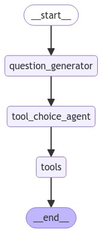

# Semantic Router

The Semantic Router is a component that is responsible for routing the user's request to the appropriate tool.

The semantic analysis is based on an AI model that evaluates the semantic proximity between the user's request and the tools.
[LangChain](https://python.langchain.com/docs/introduction/) and [LangGraph](https://langchain-ai.github.io/langgraph/) are used to organize the data flow between components.
___

## Structure overview

The Semantic Router is a LangGraph graph consisting of nodes (AI agents) and edges (connections between agents).
In the current implementation it looks like this:



### question_generator
`question_generator` agent is responsible for preparing a user message for the further work.
If the user's current message is the first one in the conversation, then we don't need to do anything with it.
But if the message is a continuation of the previous conversation with the AI assistant, then we must optimize it for the AI model.

For example, we may have two query options:
1) The question is closely related to the context. 
    ```json
        "user":        "What is the weather in New York?"
        "assistant":   "Today is sunny in New York"
        "user":        "Will it rain tomorrow?"
    ```
    "Will it rain tomorrow?" - out of context makes no sense, since the Semantic Router does not know about the location.
    Therefore, we need to optimize the request for routing regardless of the context of the question:
    ```"What is the weather in New York tomorrow?"```

2) The desire to use different tools within the same conversation.
    ```json
        "user":        "How to add GraphQL to my X project?"
        "assistant":   "You can ... Please see more info in Confluence: ..."
        "user":        "Ask chatGPT to check my code: ..."
    ```
    "Ask chatGPT to check my code: ..." - this question, although relevant to the context, requires switching to another tool.
    Therefore, we leave it unchanged and pass it on.
    
Thus, the task of `question_generator` is to understand which questions need to be optimized for the AI model, and which ones to pass on.

### tool_choice_agent
`tool_choice_agent` agent is responsible for choosing a tool to handle the user's request.
It uses a AI model to estimate the semantic similarity between the user's request and the tools based on the description for each tool.  
_Note: Having multiple examples allows the AI to switch to [few shot](https://www.promptingguide.ai/techniques/fewshot) mode, which allows better use of keywords to identify the tool._

Here is an example:
```python
@tool(return_direct=True)
def query_chatgpt(state: Annotated[dict, InjectedState]) -> AIMessage:
    """Query ChatGPT only when the user`s question explicitly contains one or more of the following keywords: "ChatGPT", "chat", "gpt", "openai".

    Ignore any queries that do not contain these specific keywords.

    Examples:
        - "ChatGPT: ..."
        - "Chat with GPT: ..."
        - "Ask gpt: ..."
        - "Find the answer using OpenAI: ..."
        - "Chatbot: ..."
        - "OpenAI: ..."
        - "Chat: ..."
    """
```

### tools
Based on the tool selected by `tool_choice_agent`, the router calls the corresponding tool and passes it all the necessary data from global state ([RouterState](../semantic_router/types.py)).  
After the tool finishes working, the graph completes its work and returns the result to the user.

Currently the router supports the following tools:
1) [Search the Confluence knowledge base](../semantic_router/tools/query_knowledge_base.py). 
   Details of using Confluence to search for information are described in the [confluence](../confluence/README.md) module.
2) [Ask chatGPT directly](../semantic_router/tools/query_chatgpt.py).
   This makes a direct redirect of the user's request to chatGPT.
3) [Web Search](../semantic_router/tools/web_search.py).
   Uses the DuckDuckGo search engine to search for information on the web.
4) [Query AI Optimization](../semantic_router/tools/prompt_optimizer.py).
   Calls a Dify workflow that helps optimize the user's AI prompt.
___

## Usage of the Semantic Router

To use the router, it is necessary to provide the user's message history in the form of a list of dictionaries:
```python
[
    {"role": "user", "content": "Hello, I want to create a new project"},
    {"role": "assistant", "content": "Sure, I can help you with that. What is the name of the project?"}
]
```
- Possible roles: `user`, `assistant`, `system`.
- If you plan to use Confluence, you will also need to provide a data access policy [PageAccessPolicy](../confluence/policy.py).
- If the user's question is a continuation of a previous conversation with the AI, you will also need to provide the thread ID of the previous conversation.  
_At the moment, we only track threads related to the Confluence knowledge base._

As a response, the router returns a message (the result of calling the tool) and the thread ID of the conversation with the AI assistant (if a new thread was created).

<details>
<summary>Example of usage:</summary>

```python
from top_assist.semantic_router.router import route
from top_assist.semantic_router.types import HistoryEntry
from top_assist.confluence.policy import PageAccessPolicy
from top_assist.semantic_router.types import SemanticRouterResponse

route(
    history=[
        HistoryEntry(role="user", content="Hello, I want to create a new project"),
        HistoryEntry(role="assistant", content="Sure, I can help you with that. What is the name of the project?")
        HistoryEntry(role="user", content="It is a project X"),
    ],
    policy=PageAccessPolicy(slack_user_id="QWERTY1", confluence_access_token="i-am-token"),
    assistant_thread_id="thread_id_xxxxxx",
)

# returns
SemanticRouterResponse(
    message="I called 'Project creation' tool for you. Here is the link to the result: https://some_link",
    assistant_thread_id="thread_id_xxxxxx"
)
```
</details>

### Adding new tool

1) Create a new file in the [tools](../semantic_router/tools) folder.
2) The file must contain a function with the signature:
    ```python
    from langchain_core.messages import AIMessage
    from langchain_core.tools import tool
    from typing import Annotated
    from langgraph.prebuilt import InjectedState
    
    @tool(return_direct=True)  
    def call_my_tool(state: Annotated[dict, InjectedState]) -> AIMessage:  # 
        # Your tool's logic is here with calls to any AI models, APIs, etc.
        message = "I called 'My tool' for you. Here is the link to the result: https://some_link"
        
        return AIMessage(
            message=message,
            assistant_thread_id="thread_id_xxxxxx"
        )
    ```
   - `return_direct=True`, if the tool returns a message directly to the user, without returning to the AI agent or interpretation.  
   - `state`, a global state that can be used to access either data or the results of other tools.  
   - `AIMessage`, an object that contains the message to the user (the response) and the thread ID of the conversation with the AI assistant (if created).  

3) Add a new tool to a list in [router.py](../semantic_router/tools/__init__.py).
4) Done!

### Adding a new Dify workflow

You can find [an example of calling Dify workflow](../semantic_router/tools/prompt_optimizer.py).

Integration with the new Dify will require only two values:
1) API endpoint of the Dify server. In general, the link looks like: `https://my_dify_server.com/v1/workflows/run`
2) Access token for this workflow. The token contains both the data for accessing the workflow and the name of the workflow itself, so there is no need to specify it explicitly.

You can find these values in `Settings -> API Access` in your Dify workflow.
